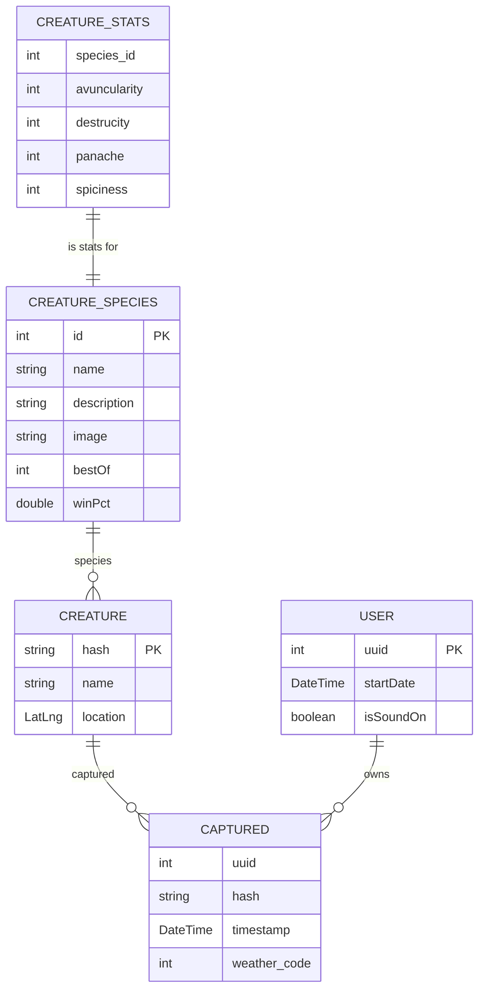

```mermaid
erDiagram
    USER {
        int uuid PK
        DateTime startDate
        boolean isSoundOn

    }
    CREATURE_SPECIES {
        int id PK
        string name
        string description
        string image
        int bestOf
        double winPct
    }

    CREATURE_STATS {
        int species_id
        int avuncularity
        int destrucity
        int panache
        int spiciness
    }
    CREATURE {
        string hash PK
        string name
        LatLng location
    }
    CAPTURED {
        int uuid
        string hash
        DateTime timestamp
        int weather_code
    }
    CREATURE_STATS    ||--|| CREATURE_SPECIES : "is stats for"
    CREATURE_SPECIES ||--o{ CREATURE : "species"
    CREATURE ||--o{ CAPTURED : "captured"
    USER ||--o{ CAPTURED : "owns"
```
